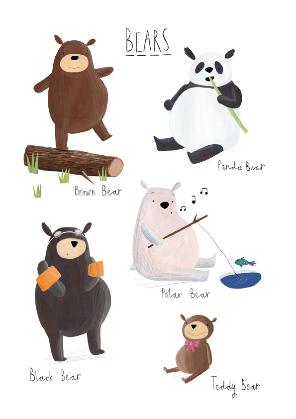

# 7 tiny bears riddle

*"Let's play a game"* - said the Master to 7 tiny bears. 

*"I have a lot of hats in 7 different colors and I will put one of them on each of your heads.
You see each other's hats, but not your own. Then, at the same same time you have to shoot the color of your hat. 
If none of you is right then I will kill you all. Prepare for the for the game. Tou have a 5 minutes and we start!"*

Tiny bears managed to come up with the right strategy and they were saved.
 Can you solve it with Java 8 streams?

See [riddle code](src/main/java/pl/hexmind/bears/Riddle.java)
 and try implement [your solution](src/main/java/pl/hexmind/bears/YourSolver.java)  

